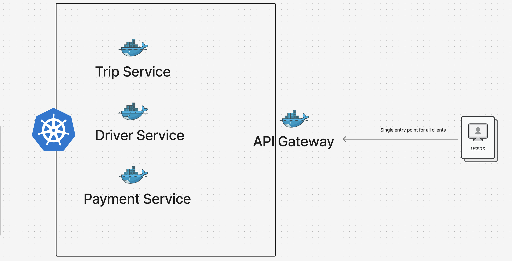
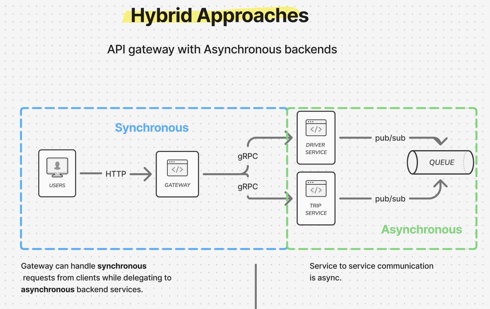

# RideFlow

RideFlow is a production-style backend for a real-time ride-sharing platform. It models the core trip lifecycle end to end: trip preview, trip creation, driver assignment, live client updates, payment orchestration, and operational visibility across distributed services.

The project is designed as a Go microservices system with clear service ownership, explicit communication boundaries, and deployment-oriented engineering practices. It is intended to reflect how a serious backend platform is structured rather than how a tutorial application is assembled.

## Overview

The system is built around four primary services:

- `api-gateway`: public HTTP and WebSocket entry point
- `trip-service`: trip preview, trip lifecycle, fare estimation, trip state transitions
- `driver-service`: driver registration, availability, matching, trip assignment
- `payment-service`: payment intent creation, webhook processing, payment status propagation

The platform uses:

- HTTP/REST for client-facing APIs
- gRPC for synchronous service-to-service calls
- RabbitMQ for asynchronous event-driven workflows
- WebSockets for real-time rider and driver updates
- MongoDB for service-owned persistence
- Docker for containerization
- Kubernetes and Tilt for local cluster development
- Jaeger and structured logging for observability

## Core User Flow

RideFlow models the following operational flow:

1. A rider requests a trip preview.
2. The system calculates route, ETA, and fare estimate.
3. The rider creates a trip.
4. The Trip Service publishes a `trip.created` event.
5. The Driver Service consumes the event and assigns an available driver.
6. The Driver Service publishes `driver.assigned`.
7. The API Gateway pushes the assignment update to the rider over WebSocket.
8. The trip progresses through its state machine.
9. The Payment Service creates and processes the payment workflow.
10. Completion and payment events are propagated back through the system.

## Architecture




The platform follows an API gateway architecture with a hybrid communication model:

- external clients communicate through a single gateway boundary
- synchronous request/response operations use HTTP and gRPC
- backend coordination and state propagation use asynchronous messaging
- real-time client delivery is handled through WebSockets at the gateway edge

This keeps the client contract simple while allowing backend services to remain independently deployable and event-driven.

```text
Clients
  |
  v
API Gateway
  |-- HTTP/REST -----------------------------> External clients
  |-- WebSocket -----------------------------> Rider / Driver live updates
  |-- gRPC ----------------------------------> Trip Service
  |-- gRPC ----------------------------------> Driver Service
  |-- gRPC ----------------------------------> Payment Service
  |
  v
RabbitMQ <------------------------------+
  ^                                     |
  |                                     |
Trip Service ---- publishes -----------+
Driver Service -- publishes -----------+
Payment Service - publishes -----------+

Trip Service ----> MongoDB (trip data)
Driver Service --> MongoDB (driver data)
Payment Service -> MongoDB (payment data)

All services -> structured logs / traces / metrics
```

### Design Principles

- Service boundaries follow domain ownership, not technical convenience.
- Each service owns its own data and business rules.
- Synchronous and asynchronous communication are used deliberately, not interchangeably.
- The gateway is an edge component, not a business-logic monolith.
- Real-time delivery is handled at the gateway boundary, not deep inside domain services.
- Operational concerns such as graceful shutdown, health checks, and observability are first-class parts of the codebase.

## Technology Stack

| Area | Choice | Version |
|---|---|---|
| Language | Go | 1.25.0 |
| HTTP Router | Chi | 5.2.5 |
| Internal RPC | gRPC | 1.79.2 |
| Protobuf Runtime | protobuf | 1.36.11 |
| Async messaging | RabbitMQ | 3.13.x |
| AMQP Client | amqp091-go | 1.10.0 |
| Real-time transport | Gorilla WebSocket | 1.5.3 |
| Persistence | MongoDB | service-owned database model |
| Container runtime | Docker | Docker Compose workflow |
| Local orchestration | Docker Compose, Tilt | local development workflow |
| Cluster orchestration | Kubernetes | deployment target |
| Tracing | Jaeger / OpenTelemetry | observability stack |
| Payments | Stripe | external provider |

## Running The System

### 1. Docker-first local validation

Docker is the recommended first path for validating the platform locally. It gives a reproducible environment and removes most machine-specific setup issues.

Start infrastructure:

```bash
make docker-up
```

Build services:

```bash
make build
```

Start the application processes locally:

```bash
make run-trip
make run-driver
make run-gateway
make run-payment
```

Stop infrastructure:

```bash
make docker-down
```

### 2. Environment configuration

Create a local environment file from the example:

```bash
cp .env.example .env
```

Important variables include:

- `GATEWAY_PORT`
- `TRIP_SERVICE_ADDR`
- `TRIP_HTTP_PORT`
- `TRIP_GRPC_PORT`
- `DRIVER_HTTP_PORT`
- `DRIVER_GRPC_PORT`
- `RABBITMQ_URL`
- `PAYMENT_STRIPE_SECRET_KEY`
- `PAYMENT_STRIPE_WEBHOOK_SECRET`

### 3. Health verification

Gateway:

```bash
curl -s http://localhost:8080/health
```

Trip Service:

```bash
curl -s http://localhost:8082/health
```

Driver Service:

```bash
curl -s http://localhost:8083/health
```

## API Surface

Representative endpoints:

- `GET /health`
- `POST /api/v1/trips/preview`
- `POST /api/v1/trips`
- `GET /api/v1/trips/{id}`
- `GET /ws?user_id=<id>`

Representative gRPC APIs:

- `trip.TripService/PreviewTrip`
- `trip.TripService/CreateTrip`
- `trip.TripService/GetTrip`
- `driver.DriverService/RegisterDriver`
- `driver.DriverService/UpdateLocation`
- `driver.DriverService/SetAvailability`

## Real-Time Flow

The gateway maintains user-scoped WebSocket connections and consumes domain events from RabbitMQ. This allows the system to push trip state changes to riders and drivers immediately rather than requiring repeated polling.

Example events:

- `driver_assigned`
- `trip_started`
- `trip_completed`
- `payment_required`

## Message-Driven Workflows

RabbitMQ is used for decoupled workflows and eventual consistency between services.

Representative routing keys:

- `trip.created`
- `driver.assigned`
- `trip.completed`

This separation allows domain services to remain independently deployable while still participating in end-to-end business flows.

## Observability

The platform is structured for production diagnostics:

- JSON structured logs via `slog`
- correlation through request IDs
- service health endpoints
- graceful shutdown handling
- distributed tracing integration via Jaeger / OpenTelemetry

In a production deployment, logs, traces, and metrics are intended to be correlated across the gateway, trip, driver, and payment paths.

## Testing Strategy

The project uses layered validation:

- linting for static analysis and code quality
- unit tests for domain logic, handlers, config, and transport behavior
- build verification for proto generation and binary compilation
- end-to-end checks for the HTTP, gRPC, RabbitMQ, and WebSocket flow

Common commands:

```bash
make help
make lint
make test
make build
make proto
make check-gateway
```

## CI

The CI pipeline validates:

- linting with GolangCI-Lint
- unit tests with the race detector
- proto generation
- service compilation
- end-to-end rider/driver assignment flow with RabbitMQ and WebSocket delivery

The workflow definition lives in [.github/workflows/ci.yml](/Users/zodiac/backend_projects/RideFlow/.github/workflows/ci.yml).

## Deployment Model

RideFlow is structured to support:

- local process-based development
- Docker-based packaging
- Kubernetes deployment with service-specific manifests
- Tilt-powered inner-loop development against a local cluster

The deployment approach is intentionally aligned with how multi-service platforms are built and operated in production environments.

## Engineering Notes

- `internal/` is used to enforce service-private boundaries at the Go compiler level.
- Shared code is limited to narrow technical helpers and messaging contracts.
- Business logic is kept inside service-owned packages instead of drifting into generic utility layers.
- The codebase favors explicit wiring and operational clarity over framework-heavy abstractions.

## Current Status

RideFlow is being developed incrementally with a production-oriented architecture from the beginning. The repository already includes the core service structure, transport boundaries, async messaging, realtime delivery, and CI workflow needed to evolve into a complete backend platform.

## License
This project is released under the MIT License. See [LICENSE](/LICENSE).

